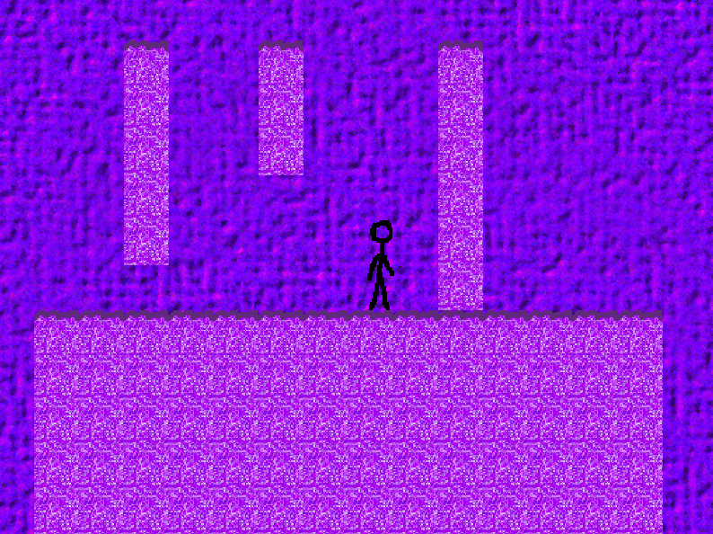

# Amethya

## Description

This is a game created using SFML as a proof of concept of state machines, animations, parallax scrolling, and more. The player controls a stick figure that can run, double jump, wall jump, crouch, and slide. The camera can track the player, and scrolls the background using parallax scrolling. The source code is located in the Amethya directory

## Requirements

C++ 17, and SFML DLLs are required to build this project